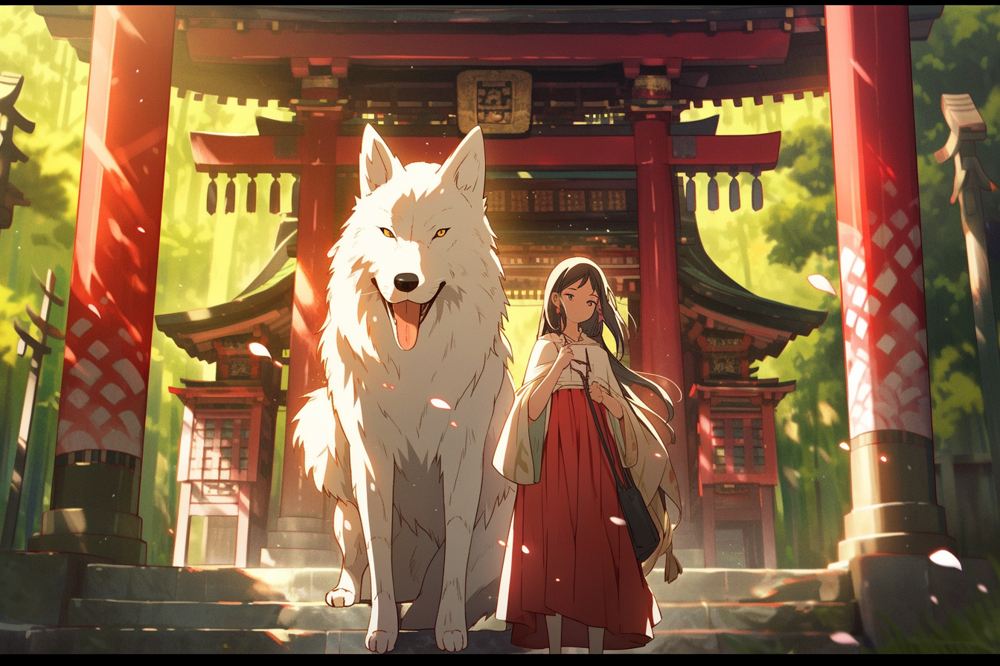
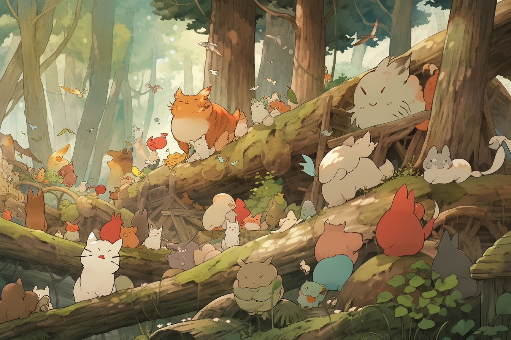
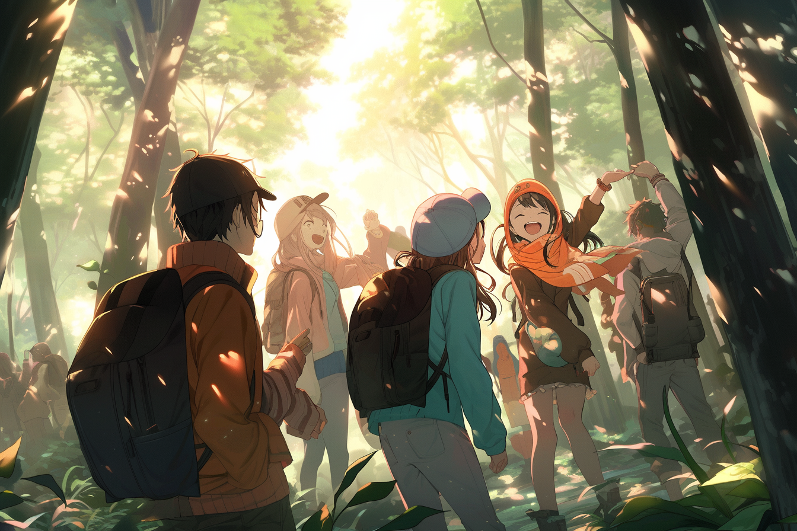
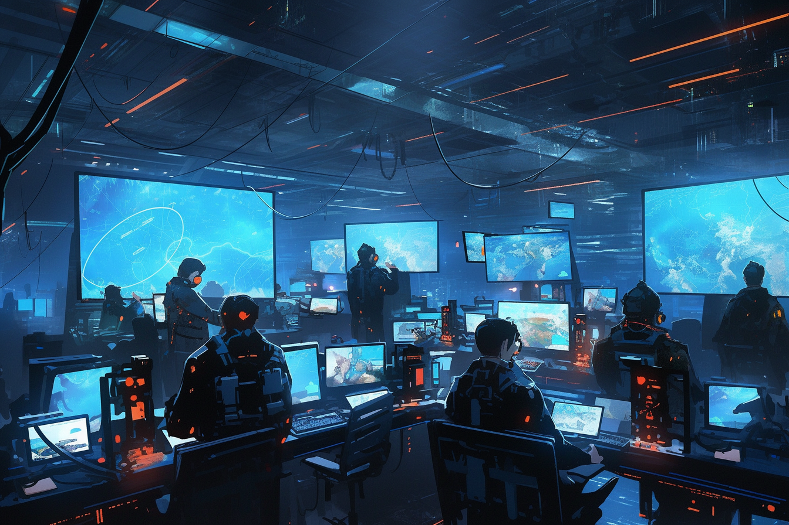
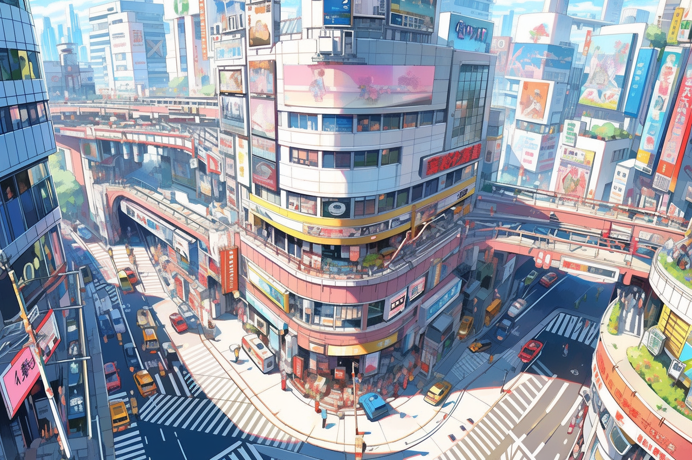
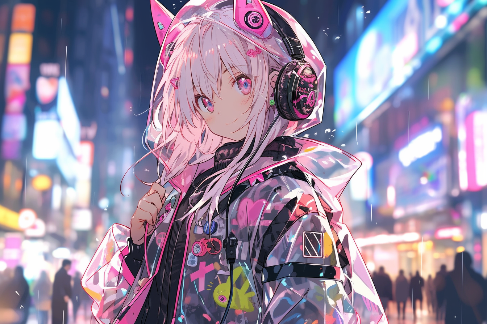

## 动漫艺术家

### 宫崎骏, 吉卜力工作室的共同创始人

> 一个穿着传统日本服装的女孩, 身边有一只白色的狼, 站在一个神奇的鸟取神社前, 吉卜力工作室

A girl in traditional japanese clothing, with white wolf beside her, standing in front of a a magical torri shrine, by Studio Ghibli --ar 3:2 --upanime

> 树林里的一群动物, 宫崎骏

A group of animals in the wood, Hayao Miyazaki --ar 3:2 --upanime

### 尾田荣一郎, 海贼王

> 一群快乐的学生在树林中冒险, 美丽的阳光照明, 尾田荣一郎

A group of happy students taking an adventure in the woods, beautiful sun lighting, Eiichiro Oda --ar 3:2 --upanime

### 武内直子, 美少女战士

### 井上雄彦, 灌篮高手

### 平井坚, 高达

> 未来主义的空间站, 一群穿着机器人服的人在处理数据, 平井坚

Futuristic space station, a group of human in robotic suit working on data, Hisashi Hirai --ar 3:2 --upanime

### 松本则夫, 全职猎人

### 藤本浩, 哆啦A梦

### 吉成曜, 新世纪福音战士

### 藤子·F·不二雄, 哆啦A梦

## 华丽的动漫背景

### 新海诚, 你的名字

### 宫崎骏, 起风了

> 宫崎骏拍摄的涉谷街道的阿里尔镜头, 宫崎骏

Ariel shot of Shibuya street, Hayao Miyazaki --ar 3:2 --upanime

### 押井守, 攻壳机动队

### 松本大洋, 恶童当街

### 庵野秀明, 新世纪福音战士

### 咖啡馆

Coffee shop

> 海滩旁的咖啡馆, 美丽的蓝天和云彩, 新海诚

Coffee shop beside the beach, beautiful blue sky and cloud, Makoto Shinkai --ar 3:2 --upanime

### 东京市

Tokyo city

### 海滩

The beach

### 教室

Classroom

### 火车站

The Train Station

### 篮球场

Basketball Court

### 空间站

The Space Station

### 城市景观

City landscape

### 富士山

Mt Fuji

> 富士山, 美丽的蓝天和云彩, 新海诚

Mountain fuji, beautiful blue sky and cloud, Makoto Shinkai --ar 3:2 --upanime

### 日本寺庙

Japanese Temple

### 浮动城堡

Floating Castle

### 水下世界

Underwater World

### 鸟取神社

Torri shrine

## 复古动漫风格

## 未来主义风格

### 色差

Chromatic aberration

### 全息的

Holographic

### 虹彩不透明薄膜 RGB

Iridescent opaque thin film RGB

> 一个动漫女孩, 看着观众, 泡泡, 高度详细, 反光的透明彩虹色不透明外套, 透明彩虹色RGB长发

An anime girl, looking at viewer, bubbles, highly detailed, reflective transparent iridescent opaque jacket, long transparent iridescent RGB hair --ar 3:2 --upanime

### 透明乙烯基服装

Transparent Vinyl Clothing

### 透明PVC

Transparent PVC

### 反射性服装

Reflective clothing

### 未来主义服装

Futuristic clothing

> Pixiv, 超细节, 原宿时尚, 未来主义时尚, 动漫女孩, 耳机, 彩色反光织物内层, 透明PVC外套, 在东京市中心。

Pixiv, hyper detailed, harajuku fasion, futuristic fashion, anime girl, headphone, colorful reflective fabric inner, transparent PVC jacket, in tokyo city center --ar 3:2 --upanime

## 漫画

## 人物和玩具

### 微型人物

Miniature character

### 动漫人物

Anime character

### 玩具人物

Toy figure

### 装在一个玻璃展示柜里

In a glass display case

### 由塑料制成

Made of plastic

### 聚酯油灰制成

Made of polyester putty

## 角色设计和概念表

### 角色表达表

Character expression sheet

### 角色设计表

Character design sheet

### 角色姿态表

Character pose sheet

### 转折表

Turnaround sheet

### 概念设计表

Concept design sheet

### 物品表/配饰

Items sheet/accessories

### 装修表/时尚表

Dress-up sheet/fashion sheet

### 全身画像

Full body portrait

## References

[1]: [50+ Best Anime Prompts for Midjourney Niji V5](https://bootcamp.uxdesign.cc/50-best-anime-prompts-for-midjourney-niji-v5-a58c62a90651/)