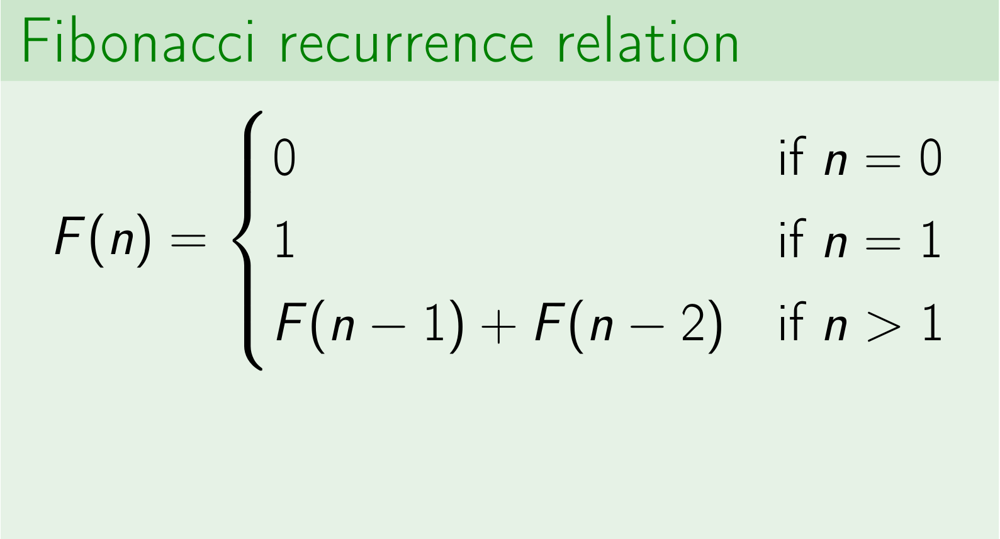
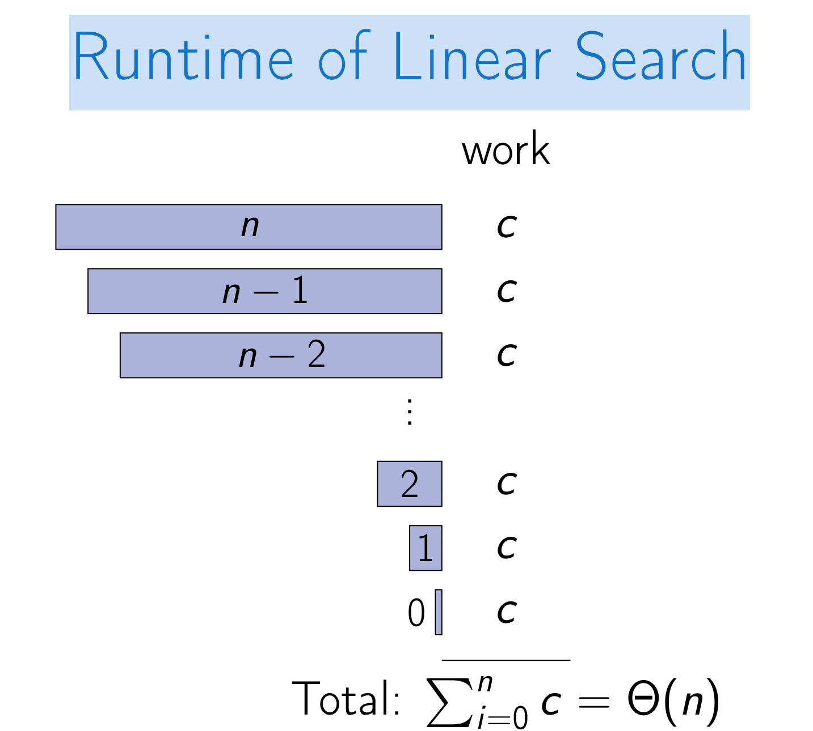
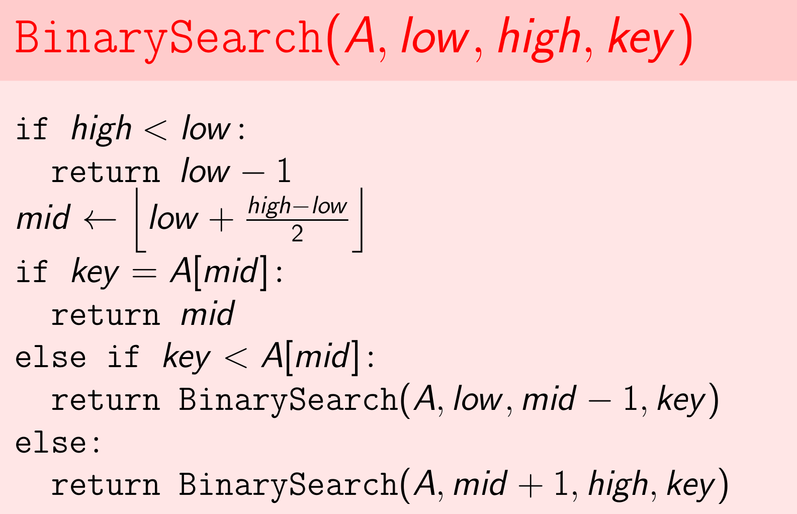
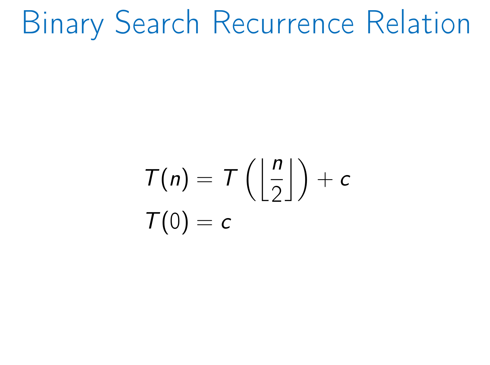
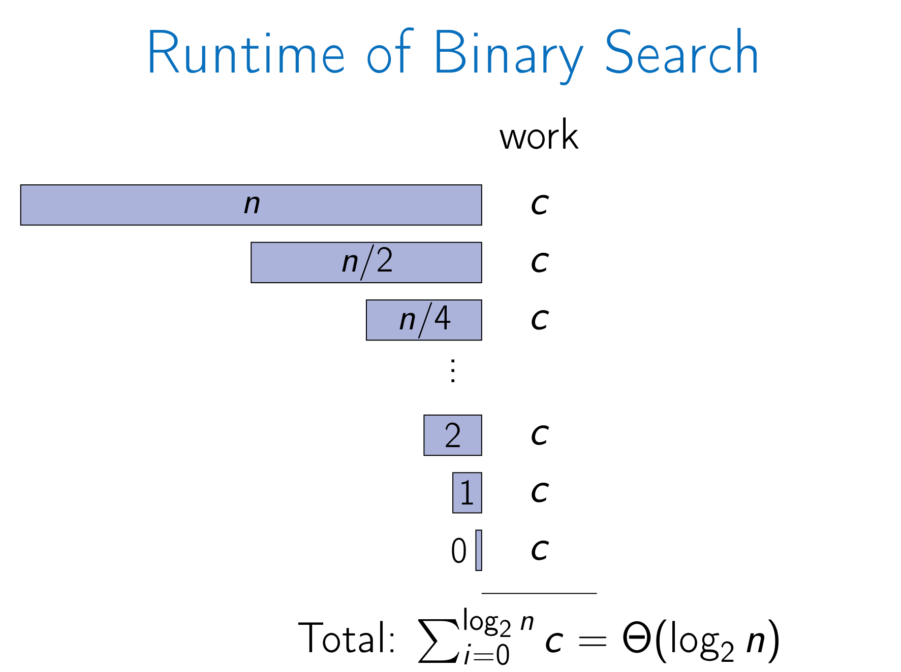
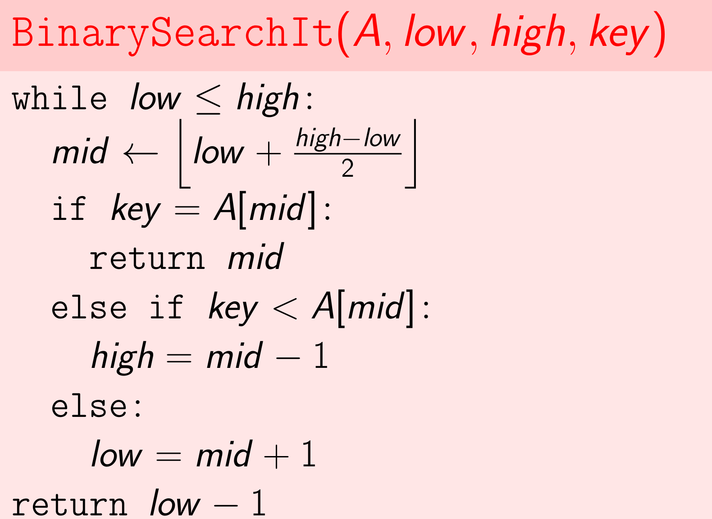

## Divide-and-Conquer: Searching in an Array

> Divide: Break into non-overlapping subproblems of the same type.

> Conquer: solve subproblems && combine results.

### Linear Search in Array

- Input:
  - An array A with n elements.
  - A key k.
- Output:
  - An index, i, where A[i] = k.
  - If there is no such i, then NOT_FOUND.

#### Recursive Solution

> LinearSearch(A, low , high, key)

- if high < low:
  - return NOT_FOUND
- if A[low ] = key:
  - return low
- return LinearSearch(A, low + 1, high, key)

> A recurrence relation is an equation recursively defining a sequence of values.

Fibonacci recurrence relation:

##### Recurrence defining worst-case time:
T (n) = T (n − 1) + c
T (0) = c

Runtime of Linear Search:

#### Iterative Version

- for i from low to high:
  - if A[i] = key:
    - return i
- return NOT_FOUND

### Binary Search Searching in a sorted array

- Input:
  - A sorted array A[low . . . high](∀low ≤ i < high : A[i] ≤ A[i + 1]).
  - A key k.
- Output:
  - An index, i, (low ≤ i ≤ high) where A[i] = k.
  - Otherwise, the greatest index i, where A[i] < k.
  - Otherwise (k < A[low ]), the result is low − 1.

> BinarySearch(A, low , high, key )

#### Binary Search Recurrence Relation

#### Runtime of Binary Search

#### Iterative Version

> BinarySearchIt(A, low , high, key )

## Divide-and-Conquer: Polynomial Multiplication