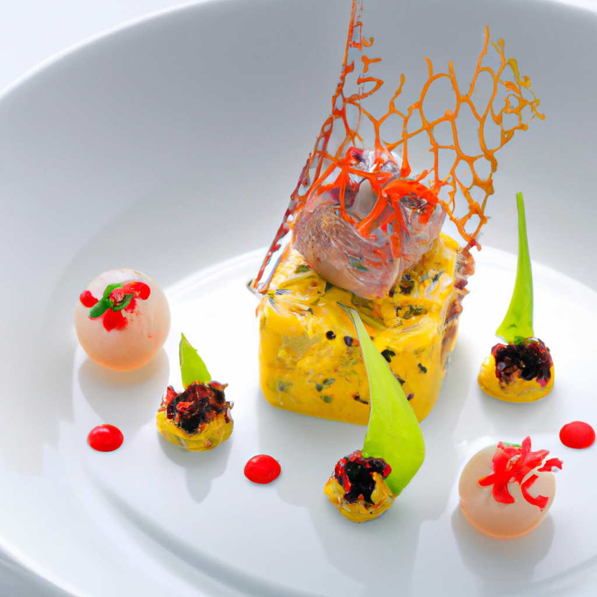
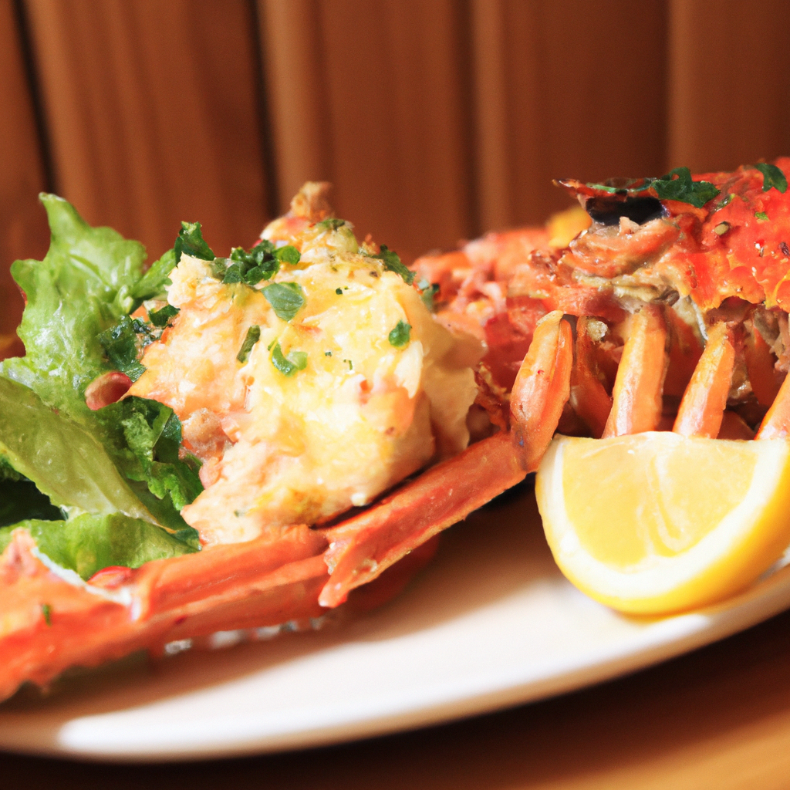
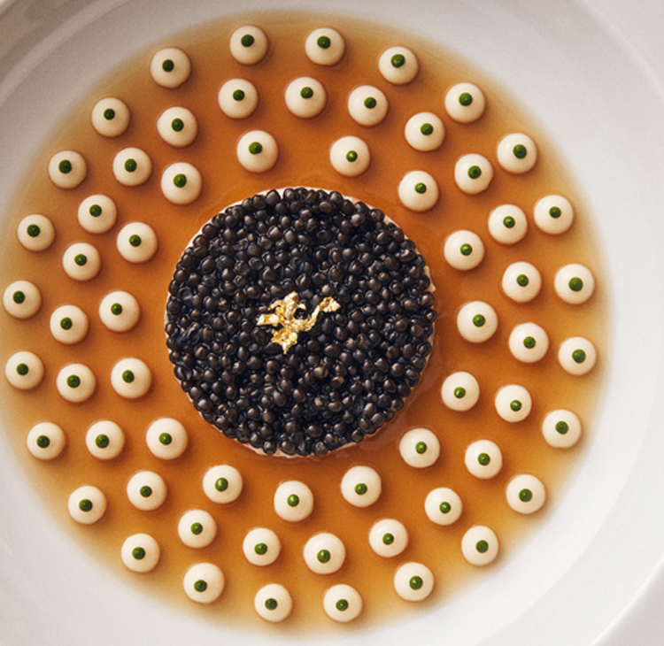
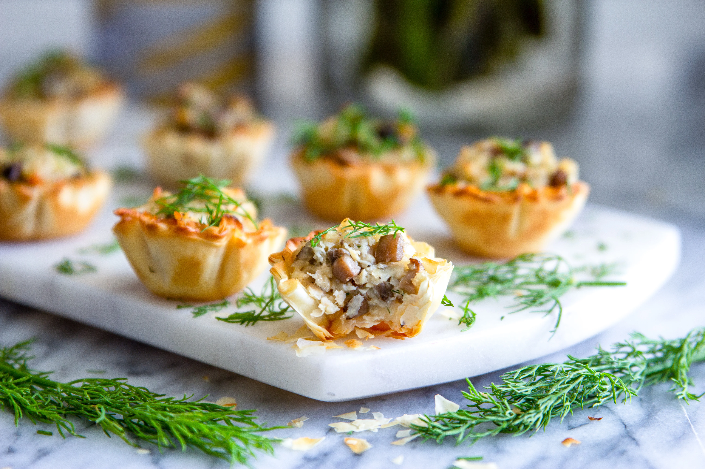

## What Is Generative Ai

Artificial Intelligence (AI) has been a buzzword for quite some time now. It has revolutionized the way we live, work, and interact with technology. One of the most exciting applications of AI is Generative AI, which has the potential to create new and innovative designs, art, and even food plating. In this article, we will explore what Generative AI is, its history, and how it can be used to create stunning food plating.

### What Is It?

Generative AI is a subset of AI that involves the use of algorithms to generate new and unique content. It is different from traditional AI, which is designed to solve specific problems. Generative AI is more creative and can produce new content that has never been seen before. It is used in various fields, including art, music, and design.

### History

Generative AI has been around for quite some time. The first generative algorithm was developed in the 1950s by a computer scientist named John von Neumann. However, it was not until the 1990s that Generative AI started gaining popularity. In 1997, a computer program called AARON was developed, which could create original art. Since then, Generative AI has been used in various fields, including music, design, and even food plating.

### Idea Behind

The idea behind Generative AI is to create something new and unique. It involves the use of algorithms that can learn from data and generate new content based on that data. The algorithms can be trained on various datasets, including images, text, and audio. Once the algorithm is trained, it can generate new content that is similar to the data it was trained on.

### Tools

There are various tools available for Generative AI, including ChatGPT, DaliE, and Midjorney. These tools use different algorithms to generate new content. ChatGPT is a language model that can generate text based on a given prompt. DaliE is an image generation tool that can create new images based on a given input. Midjorney is an image generation tool that can create new image based on a given input.

## What We Are Going To

### How We Can Use These Ai for Food

Generative AI has the potential to revolutionize the way we create food plating designs.

### What Is Foodplating.ai

Food plating is an art form that involves arranging food on a plate in an aesthetically pleasing way. It requires creativity and skill to create a visually appealing dish. Generative AI can be used to create new and innovative food plating designs. FoodPlating.AI is a tool that uses Generative AI to create new food plating designs. It can generate new designs based on various inputs, including the type of cuisine, ingredients, and plating style.

By using tools like ChatGPT, DaliE, or Midjorney, we can generate new and innovative designs that have never been seen before. With our solutions and techniques, we can create stunning and visually appealing food plating designs that will delight and amaze diners.

### Technical Difficulties

Using Generative AI for food plating is not without its challenges. One of the main challenges is the lack of data. Unlike other fields, there is limited data available on food plating. This makes it difficult to train the algorithms on food plating. Another challenge is the subjective nature of food plating. What one person finds aesthetically pleasing may not be the same for another person.

### What We Make / Configurations

To overcome the challenges of using Generative AI for food plating, we  use tools like ChatGPT, DaliE, or Midjorney. These tools can be trained on various datasets, including images of food, recipes, and plating styles. By using these tools, we can generate new and innovative food plating designs. Additionally, we can create a website on FoodGPT that allows users to input various parameters, such as cuisine, ingredients, and plating style, to generate new food plating designs.

## Some Test Results

### Totally Imaginary Combinations

#### Prompt with Chef Name

> キャビア 甲殻類のジュレになめらかなカリフラワーのクレーム by Martin Yan in Nordic plating



> すきやばし次郎が作るキャビア 甲殻類のジュレになめらかなカリフラワーのクレーム



#### Prompt with Style

##### Noma Scandinavian Uni Signature Dishes


#### Prompt with Combinations

##### Eggplant Bonito Green French Style Appetizer


##### Salmon Apple Ginger Yuzu Appetizer Innovative


### Synthetic Pic Comparison  vs Real Pic

#### Joel Robuchon Uni Signature Dishes

##### Generative Ai


##### Real



#### Wild Mushroom Autumn Appetizer

With ```season``` key word!

##### Generative Ai


##### Real

