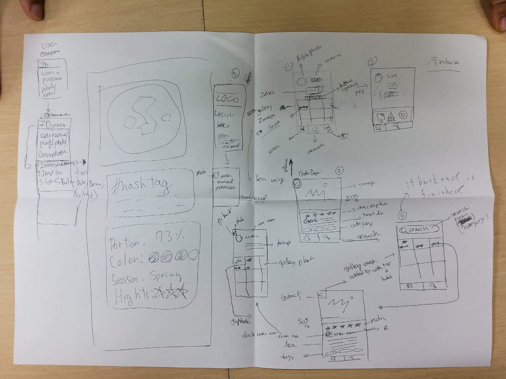

## この記事は多言語で掲載されており、ディープラーニング翻訳によって翻訳されました

这篇文章有多语言版本，由Deep Learning Translate翻译。中文版:

This article is available in multiple languages and was translated by Deep Learning Translate. For English:

## 猫の精神状態について問い合わせる

ここでいう「猫猫」とは私（筆者）のことで、私の通称は「柚木（ゆずき）」なので、「ゆず」、「ゆず猫」、「猫猫」と呼んでください。
通称とは、日本に住んでいる外国人が生活しやすいように使う名前のことで、日本人の名前のように、役所に登録してから法的効力（サインなど）を持ったり、役所に登録しなくても日常的に使えたりする。
猫が現在働いている会社では、上司が口頭で通称の使用を認める制度がある（将来、上司が逆ギレして制度を廃止する可能性は否定できない）。

2023年9月27日、今働いている会社の上司が不満な点を書き連ね、私にレビューを書くよう依頼してきた。 私はそれが事実無根だと思ったので、受け取りを拒否した。 しかし、彼は私にそれを押し付けたので、私は彼の前でそれを破った。
このPUA（パワハラ）事件はオフィスの隣の会議室で起こり、そこには私とボス以外誰もいなかった。私はインターンに呼ばれ、ボスは口頭でリストを読み上げ（私の目を見る勇気もなかった）、私はその一部始終を録音した。 [**録音の完全版へのリンクはOne Drive - 230927_1714.wav**](https://kamisu66-my.sharepoint.com/:u:/p/yuzuki_cat/EeMGq3TcRGVKjO--3rvgyA8BrQjgZiBRkvMlYbTJe89Y7A?nav=eyJyZWZlcnJhbEluZm8iOnsicmVmZXJyWxBcHAiOiJPbmVEcml2ZUZvckJ1c2luZXNzIiwicmVmZXJyYWxBcHBQbGF0Zm9ybSI6IldlYiIsInJlZmVycmFsTW9kZSI6InZpZXciLCJyZWZlcnJhbFZpZXciOiJNeUZpbGVzTGlua0RpcmVjdCJ9fQe=c9bHXA)。
心がストレスや不安の状態にあることが多いので、変な声に聞こえるのはご容赦ください。

続報ですが、2023年10月9日に今働いている会社の上司が宅急便を自宅に送っていることがわかりました。 今のところ放っておくつもりですが、彼は病気で私を追い出したいのだと思います。

日本での労働仲裁のための法的支援を求めています。 今いる会社の上司は、長い間私をPUA（パワハラ）扱いし、私に責任を取らせ、私のうつ病を悪化させ、統合失調症を発症させました。 同時に、彼は故意に私の死んだ名前と間違った性別を使って私に話しかけた。 始めてからのメール記録、Discordグループ、プライベートチャットの記録はすべて持っている。 ミーティングや会話の一部。 機密でない部分はこの[Githubリポジトリ - yuzukicat/evidence.yuzuki](https://github.com/yuzukicat/evidence.yuzuki)とOne Driveで公開した。

今いる会社の上司が家に宅配便を送って嫌がらせをしてくる。 彼は私に対して長い間PUA(パワハラ)の前科があり、私がレビューを書くために文書化されていないリストを社員の家に郵送するのは嫌がらせだ。 第二に、社会的に、私はGASのリマインダーを忘れるADHDである...しかし、私の「処分のために彼の宅配便を置く」ことが予測可能な行動や罠でないことを確認する必要がある。 彼には弁護士がついているのかもしれない（あるいは私が統合失調症になっているのかもしれない）。

ところで質問があるのですが、なぜ今すぐ私にDiscordかE-Mailを送らないのですか？彼は私がDiscordとE-Mailのバックアップを取っていることを知らないと思う（彼がその後削除したくても、その時点ではバックアップが残っているはずだ）。

## 猫宣言

1.証拠の開示は、私に対する会社の守秘義務に従ったものです。私は入社時に秘密保持契約書や情報開示契約書に署名するよう求められなかったし、雇用契約書にもそのような要件はない。 また、RTFMと呼ばれる会社の非公式な規則や規定にもその義務はない。 会議の録音にテープレコーダーを使用することについて、上司は何度か「Fell Anonying」という言葉で異議を唱えたが、その異議が規制上または法律上の効果を持つとは思えない。

2.私の出勤に問題はない。 私の給与明細には会社の納税記録が記載されている。 ここでいう税金とは広義のもので、社会保険や年金の支払い記録も含まれる。 これらの記録自体が、私が「自分の時間を売って給料をもらっている」と会社が認識している証拠となる。 そのほかにも、毎日の業務内容を報告する日報制度や、上司と同僚が一緒になってその日の業務計画を確認する朝礼制度なども裏付けとなる。 これは、私の業務内容も適切な手続きを経て認識されていたことの証明になると思います。 日報制度については、私の日報の一部が[**このgithubフォルダ** - I.開発者ログ](https://github.com/yuzukicat/evidence.yuzuki/tree/main/I-development-diary)と[II.作業報告書]( https://github.com/yuzukicat/evidence.yuzuki/tree/main/II-work-report) と [III.Weekly Report](https://github.com/yuzukicat/evidence.yuzuki/tree/main/III-weekly-report)が見られる。
勤務記録のもう一つの証拠は、私が携わったプロジェクトについては、Github Commitsがあることです。Github Commitsは非公開の会社のリポジトリなので公開できませんが、司法書士がアクセスできるはずです。 年次休暇や病気休暇を取り、事前に申請し、Discordチャンネルでメールやメッセージを送る手続きをし、Googleカレンダーに記入した 3.

3.私は、「現在勤務している会社の上司が不満な点を列挙し、私にレビューを書くよう依頼してきた」という事実に鑑み、その後、会社から提供された書類については、上記の通り、事実無根であり、疑義があるため、公式・非公式を問わず、承認・署名を拒否することをここに宣言します。 前述したように、私は「テープレコーダーによる会議の録音禁止」、「Discordや電子メールの記録の開示禁止」、または同様の規則に拘束されることはありません。 2023年10月10日以降に現在の会社から発行された、そのような規則や制限について、私が署名しており、それを守るべきであると主張する声明は、真実ではありません。 もし会社がその旨の証拠を提示できるのであれば、それらはいずれも私が自発的に署名したものではなく、強制されたもの、偽造されたもの、あるいはそれに類するものである。
**NDAにはサインしていないし（入社時にサインするように言われるのを忘れたから）、契約書にもないし、就業規則にもない（わざわざ修正・追加しなかった）。 だから、彼らとのトラブルは恐れていない。 **

## パワハラに関する証拠の連鎖

私が今勤めている会社の上司は、長い間私にPUA(パワハラ)をし、私に責任を負わせ、私のうつ病の症状を悪化させ、統合失調症を引き起こした。 同時に、彼は故意に私の死んだ名前と間違った性別を使って私に話しかけた。 その証拠の連鎖は以下の通りである。

### FoodPlatingAIプロジェクトのパワハラ

これは主に2022年末から2023年2月末にかけて起こった。

私はバックエンドエンジニアとして時間通りに仕事を完了した。 そして、フロントエンドに簡単にアクセスできるDemoを提供した。 上司は私に、「お前が終わったと言ったからといって、終わった証拠にはならない。 もちろん、彼は私の簡単なデモを確認するだけでよかったのであり、もっとテストをしたいのであれば、私に言うべきでした。 でも、この会社にはQAに関する特別なルールはないので、私は自分の仕事をしたと報告できると思います。

彼はフロントエンド部分が予定通りに完成しなかったことにも、フロントエンドのデザインにも満足していなかった。 このプロジェクトの会議中の録音によると（**One Drive**上の録音証拠を参照）、私はこのプロジェクトのリーダーではなく、プロジェクトのリーダーは別の同僚だった。

しかし、正社員として、また最初からこのプロジェクトに携わってきた社員として、プロジェクトの失敗の一義的な責任は私にあるはずだと、上司から責任感のなさを批判されました。

私はバックエンドエンジニアであり、プロジェクトマネージャーではないので、プロジェクトの進捗を管理する義務もなければ、フロントエンドの同僚に一刻も早く終わらせるよう促す義務もないことを明確にしておきたい。

フロントエンドには設計書がなかった。 フロントエンドには設計書がなかった。 設計書は上司の指示によるものだった。 ボスは選択的な忘れっぽい人で、「Instgramスタイルのウェブサイトを作れ」といった非現実的なアイデアをよく思いつく。 Figmaタイプの図面すらなかった。 デザイン画とは呼べないような**手描きの下書き**があるだけだ。 プロジェクト・ミーティングに参加しなければ、古代エジプトのフレスコ画のようなこの草稿が何を意味しているのかわからなかっただろう。 もちろん、これはフロントエンドの部分だ。 私はフロントエンドはあまり書かない。

> Instgramスタイルのウェブサイトを作ろう

> 古代エジプトのフレスコ画のような下絵

プロジェクト全体としては、営業の失敗（社長が営業を兼務していたのだろう）により、開発の方向性が2度変わり、ターゲット顧客もB2BからB2Cへと1度変わった。

しかし、その上司にPUA(パワハラ)されたことで、うつ病が悪化し、深刻な自傷行為に走った([TW警告 これは、**傷の処置が不適切だったため、手を引っ掻いて膿んでしまったの写真です** - One Drive](https://kamisu66-my.sharepoint.com/:i:/p/yuzuki_cat/EYnDviyu1UxHrbVB3gQZEdIBpf9tUBRmpmr6Ltzv3K-muw?e=6gwCNw))、OD傾向、強い自殺念慮があり、その後の診断で統合失調症と診断されました。 **これは主治医から言われたことです：**「あなたの病状悪化と統合失調症は職場環境に直接関係している」**。

トランスジェンダーである私は、この時期、上司から意図的に死語と性別を間違えて呼ばれた（[**証拠としてDISCORDのチャットログを参照 - このエントリーのGithubリンクを参照**](https://github.com/yuzukicat/evidence.yuzuki/blob/main/IV-dis-pipeline/Direct%20Messages%20-%20Private%20-%20junyamadera%20%5B991178376134021140%5D.html)).

また、「統合失調症」でありながら、この間、カミングアウトさせられた私の「統合失調症」的見解は、次のようなものである：年末調整で会社に情報を提出する必要があるため、会社は私が「精神障害者」であることを知っている。 会社は私が「精神障害者」であることを知っており、それが一連のPUA（パワハラ）の始まりと重なった。 明らかに、前述のようにプロジェクトの失敗は避けられなかった。 私は、上司がトランスジェンダーや知的障害者を差別し、その責任を私に押し付けて退職に追い込むために利用しただけだと考えている。

この動機の正否はともかく、PUA（パワハラ）の存在は**DISCORDのチャットログ**が証明している：

> フードプレーティングは一体全体どうなってますか？前回のmtgで厳しく言ったと思うのですが、全く進捗の報告もなく、一番最悪のデッドラインとして1月末と伝えてみんなで共有したと思いますが、いまだに何ももらっていなく大変不満です。前回のmtgですでに大幅に遅延しており、都度都度進捗を共有してくださいと強くお願いしてますが理解していますか？明日こちらで実際のお客様候補に話するのに、何も見せるものもないし、何のテストもしていません。本当に困っています。またこういう仕事の仕方は許容できないです。できてないのであれば事前にその旨をダイさんから報告すべきですし、もしできてたとしてもテストもしていないし使い方も何も聞いてません。もしダイさんが逆の立場、あるいはお客様の立場だったらどう思うでしょう？本当に真剣に考えてもらえますか？とにかく今の状況すぐにでも報告してください。もう限界です。
もし最低限のことができないならプロジェクトを任せることはできないので外れてもらうことも検討しなくてはならないです。これに限らず普段の仕事でも自分の仕事の共有や報告があまりにも無さすぎます。ちょっと本気で仕事の仕方考えてください。本当にまずいです。

> それはちょっとおかしくない？
デッドラインは1月末で最優先でやれと言ってたよね？
途中で報告無いのもおかしいと思わない？
アルバイト任せじゃ無くそこはフルタイムの人が責任持ってやるべきでは？
しかも現時点でいつできるのかも分からないって仕事として成り立ってないよ

> それがおかしいよ。玉橋くんこのプロジェクトのリーダでも無いしこの前ゆずきができてなかったからお手伝いしてるだけだし。
彼とは毎日目の前で仕事してるのに全然コミュニケーションとってないのかな？
あまりにも他人任せすぎじゃないかな？

> それは甘え過ぎだよ。
ゆずきさんができなかったからお手伝いしてもらってるだけだよ。彼も他のプロジェクトで精一杯だから無理ですよ。
毎週のweekly mtgや朝の朝礼でそれがわかるよね？
分からないならきちんと自分から期間と

> わざわざフランスに来たけどできてない事、何も見せるものが無いことは分かったので、しょうがないのでこちらでみんなに謝ってきます。正直本当にまずいけど、何よりもゆずきさんがこのプロジェクトに責任感をもっと持たないとダメです。アルバイトや他人任せでは無く自分の仕事に責任をもっと持ってもらいたいし、できてもできなくてももっと周りとコミュニケーション取っていれば防げたことと思います。きちんと理解してもらいたいです。

日本語の常識がある人なら、これらの発言がひどいことはわかると思う。

### スーパーマーケットAIプロジェクトのパワハラ

上記の事件以降、Discordのチャット記録やE-mailの記録の定期的なバックアップはもちろんのこと、ミーティングの記録やミーティングで合意した要件やデザインスタイルを文書化し、何度かメールで確認することが必要だと思う。 私はプロジェクトマネージャーでもプロダクトマネージャーでもないが、これらのことを実際にやり始めた。 そのため、非常に完全な証拠の連鎖が形成された。

2023年8月29日**、私と上司だけで、製品自体のレビューミーティングが予定されており、オフィスの隣の会議室で行われた。 会議室には他に誰もいなかった。 私はボイスレコーダーで会議の様子を録音した。

会議は「計画」通りには進まず、私に対する批判的で個人的な攻撃となり、まったく事実と異なるものとなった。 その上司は、私が「会議は本題から外れてしまった」と提案すると、「会議のテーマを決める権利がある」と無礼にも主張した。 [**Link to full version of recording on One Drive** - 230829_1409.wav](https://kamisu66-my.sharepoint.com/:u:/p/yuzuki_cat/EQo6VNiIIxlOjKAsea1e7DgBAG7uNc7f_Kegj1mjFJWoNQ?nav=eyJyZWZlcnJhbEluZm8iOnsicmVmZXJyWxBcHAiOiJPbmVEcml2ZUZvckJ1c2luZXNzIiwicmVmZXJyWxBcHBQbGF0Zm9ybSI6IldlYiIsInJlZmVycmFsTW9kZSI6InZpZXciLCJyZWZlcnJhbFZpZXciOiJNeUZpbGVzTGlua0RpcmVjdCJ9fQe=H4Lygh)。

この録音証拠については、Eメールのやりとりの証拠と合わせて、事実の矛盾とパワハラを指摘する[**Eメールのやりとりの証拠は、このGithubリポジトリ**にある](https://github.com/yuzukicat/evidence.yuzuki/tree/main/V-email-pipeline/2023)にある。

1.ボスは、SupermarketAIプロジェクトの遅れの主な責任は私にあると言った。 私は、まず第一に、私は自分のパートを予定通りに完了し、遅れの原因はAI部門に割り当てられたAIのパートにあると指摘した。 私は同僚として、この部分を担当しているAI部門の担当者に繰り返し親切に注意しました（[**証拠としてこのメールを参照**](https://github.com/yuzukicat/evidence.yuzuki/blob/main/V-email-pipeline/2023/5/15/1881d57b7a421ea1.mht)).

> 特定の時間帯（例えば、12、15、17）における毎日の売上を重ね合わせるAI予測は、私ではなく、**マーク**が担当します。 私が担当するのは、以下のことです。マークから提供されたデータを視覚化する責任があります。

そして、私はプロジェクト・リーダーではないので（※※※証拠メールを参照、ボス自身も後で録音で認めている）、AI部門の同僚をプッシュする義務も権限もない。 しかし上司は、主な責任は私にあり、コミュニケーションに問題があり、私がこのプロジェクトの優先順位を明確に伝えていなかったと主張した（***録音された証拠を参照**）。

2.エンジニアとしての私の能力に対する屈辱。 上司の主張は、この仕事は完全に単独で行われたわけではなく、すべて同僚のエドワードの助けを借りて行われたものであり、同僚Cが最も貢献し、私はほとんど貢献しなかったというものだった。 これが私のエンジニアとしての能力を辱めようとした意図的なものなのか、それとも彼の選択的健忘症がまたもや現れたのかはさておき。 彼の正確な言葉はこうだった。 とにかく、これは非常に典型的なPUA（パワハラ）である。

私はこの会議で緊張と不安を抑えるのに必死だった。
まず、エドワードがこのプロジェクトに参加したのは、ボス自身からの要請であり、私は[**このメール**](https://github.com/yuzukicat/evidence.yuzuki/blob/main/V-email-pipeline/2023/5/15/1881d57b7a421ea1.mht)でも懸念と異論を述べている。
> バイトに頼りすぎない方がいいと思います。

会社の週次ミーティングで上司がエドワードに誘ったということを、会社の同僚かエドワード本人が**人証**として証言すればいいと思います。 そうなると、「パートタイマーに頼りすぎていた」という主張は成り立たない。 仕事の取り決めに従っただけだ。

それから、Crの貢献についてだが、**FoodPlatingAI project パワハラ**を読めば、これが単なるマネジメントの混乱であることが理解できるだろう。 Crの成果物が当初の設計概要から完全に逸脱していたため、当初の打ち合わせで解決し、メールでも確認した設計パターンに従ってプロジェクトが進められましたが、やはりこの会社はアジャイルすぎて、Crがデモを発表した後のある時点で、下準備に多くの時間を費やしたにもかかわらず、当初の設計パターンが事実上非推奨になりました。
スタイル変更に関する正式な文書はなく、私でさえ知らなかった（Crが直接ボスとやりとりしていたため）ので、最終的に製品がCrのソリューションを採用し、デザインスタイルと一致しなかったことに困惑した。 もちろん、ある視点から見れば、これは「プロジェクトメンバーの貢献の可視化」の問題なのかもしれないが、動機はともかく、PUA（パワハラ）の存在は事実である。

最後に、前の記事にも書いたが、このプロジェクトは私がPDプロジェクトから事実上追い出された後に投げ出した、クソ山のようなプロジェクトである。 プロジェクトのオリジナル・リーダーは昨年退職し、プロジェクトのコードは激しくバグだらけだった（**FoodPlatingAIプロジェクトのパワハラ**を読んでいただければ、私が述べたように、会社には明確なQA基準がないことをご存知だろう）。 私自身と他のチームメンバー（Edward、Zhao、Yifanを含む）は、既存のバグを修正するために多くの時間と労力を費やし、その作業はGithub Commitsによって文書化された。 ボスはGithub Commitsを読むことができないし、読もうともしない。 私がこのことを上司に報告しても、上司はいまだにこの事実を「選択的に忘れる」のだ。
AI部門の同僚でプロジェクトのリーダーは、「データはすでにクレンジングされている」と主張した([**このメールを参照**](https://github.com/yuzukicat/evidence.yuzuki/blob/main/V-email-pipeline/2023/5/12/1880e245e303fea4.mht)).
> データ自体はすでに処理され、クリーニングされています。
データ自体はすでに処理され、クリーニングされています。 実際にはクリーニングされていないので、データクリーニングを行うために余分なコードを書かなければなりません。 もちろん私はデータエンジニアではない。 私はこのことを何度か上司にメールや口頭で報告したが、選択的に忘れられてしまった。
AI部門とのミーティングで、私は「生データとクリーニングされたデータの違いは何ですか」と尋ね、AI部門はこう答えた。 これもまた、データがクリーニングされていなかったことを認めたことになる。 [**この会議の議事録を参照**](https://github.com/yuzukicat/evidence.yuzuki/tree/main/VII-record-of-proceedings)
> 生データとクリーンアップされたデータの違いは何か？

この議事録は、会議の録音とOpenAI Whisperの音声テキストモデルからの翻訳である。 [**One Drive**上のミーティング録音** - 230802_1255.wav](https://kamisu66-my.sharepoint.com/:u:/p/yuzuki_cat/EaVqCIW05ktNvsUE9CJ2WLABPlbrZF3LCVo57HDangS4PQ?nav=eyJyZWZlcnJhbEluZm8iOnsicmVmZXJyWxBcHAiOiJPbmVEcml2ZUZvckJ1c2luZXNzIiwicmVmZXJyWxBcHBQbGF0Zm9ybSI6IldlYiIsInJlZmVycmFsTW9kZSI6InZpZXciLCJyZWZlcnJhbFZpZXciOiJNeUZpbGVzTGlua0RpcmVjdCJ9fQe=5LBTZa)。
会議では、AI部門自身が拡張機能の存在を認め、それに従って説明した。
しかし、**キャット・ステートメント**のように、ボスはこれまで私をPUA(パワハラ)し、遅延は私の責任不足が原因であり、私が第一義的に責任を負うべきだ(take the blame)と言ってきた。

### 最近のパワハラ事件

上記は証明できるPUA（パワハラ）事件のみである。 実際には、口頭で、記録もメールもないPUA（パワハラ）事件がたくさんある。 その動機は、ただ面白半分でガス灯のような知的障害者かもしれないとさえ私は推測している。 なぜなら、エドワードも同様の嫌がらせを受けているからだ。 エドワードは名乗り出て発言する気があれば、**人間の証人**として利用できる。 たとえエドワードが仕事を辞めてアメリカに戻ったとしても。

この悪意さえも露骨すぎる：**例えばこのメールを参照**。 私は年次休暇を、医師の診察に行くために妥当な時間を取るために使っただけで、1週間前に申請した。 上司はそれを意図的に拒否し、「会社には拒否する権利がある」「RTFMには2週間前に休暇を取らなければならないというルールがある」「君に与えられた仕事がある」「君は忙しくなければならない」と私をPUAした。 忙しくしろ」。 事実、会社が年次休暇を付与しておらず、私が個人的な理由で出席できない場合、会社は私の給与から該当する時間を差し引くべきである。 しかも、2週間前に申請しなければならないという条件は、RTFMの中に見当たらない（マジで事前に目を通しておいた）。 こんなつまらないところでキモイ思いをさせるのは島いじめの一種だろうし、RTFMに書いてあるのになぜ見つからないんだ！というのも無理がある。
と懇願したところ、口頭で（正式にメールを返さずに）承諾してくれた。 [** この録音を参照** - 230904_1635.wav](https://kamisu66-my.sharepoint.com/:u:/p/yuzuki_cat/EZvhfgUz-MhGp9Pf2n1xXb0BUxQpwYf0GkWFvv3kJsY3vg?nav=eyJyZWZlcnJhbEluZm8iOnsicmVmZXJyWxBcHAiOiJPbmVEcml2ZUZvckJ1c2luZXNzIiwicmVmZXJyYWxBcHBQbGF0Zm9ybSI6IldlYiIsInJlZmVycmFsTW9kZSI6InZpZXciLCJyZWZlcnJhbFZpZXciOiJNeUZpbGVzTGlua0RpcmVjdCJ9fQe=BKvXXp)の会話をすべて録音した。 もちろん、統合失調症と診断された私は、彼が休暇を口頭でわざと承認しているのではないかと疑っているが、電子メールには正式に返信しないし、私が医者に行ったとしても、彼が承認したという証拠を書面で提出することはできない。

PUA（パワハラ）の定期的な存在は、集団の名を借りた私への個人攻撃であり、それは**SupermarketAIプロジェクトにおけるパワハラ**の記録にも見られる。 レトリックはこうだ。 誰もがそう思っている」。 今考えてみると、このような話し方はASDの猫にとって非常に有害であると言わざるを得ない。 というのも、ASDerとして、私は社会的に十分な仕事ができていないのではないかと思っていたはずなのに、上司が権威ある立場に立って、こう言うのです：「プロジェクトが失敗／延期になるのは、あなたが十分にコミュニケーションできていないからだとみんな思っている」。 自分が生きている価値がないような気がしてくる。
ある時、私は彼に尋ねた。「みんなそう思っていると言ったのだから、みんなを呼んで意見を投票してくれないか？ 彼はこの陰口に対して一日中怒っているようだった。 ASD患者は、簡単に挑発したり、相手に誘導されて、自分が悪いことをしていないことを認めさせたりする。おそらく、自白に陥れられるのと同じようなもので、**SupermarketAIプロジェクトのパワハラ**の録音で、この種のいじめや嫌がらせの陰湿さに気づくかもしれない）私は、少し精神状態が良いときや、正気が保たれているときには、何度か言い返すだろう。 しかし、今となっては、何をやっても無駄なんだろうな、GASライトならずっとGASライトなんだろうなと感じている。

相談した後、友人の一人が教えてくれたのは、まず会社はあなたの能力に合った仕事を割り当てるか、適切なトレーニングを提供するべきだということだった。 会社は能力不足を理由に解雇することはできても、あなたを批判する権利はない。
私はこのことにずっと気づいていなかった。

私は2023年4月6日に慶應義塾大学病院の医師から統合失調症と診断され、2023年6月1日にスルピリドを処方されて抗精神病薬の服用を開始した。 主治医曰く、**「体調の悪化と統合失調症は職場環境に直結している」**。 上司のPUA(パワハラ)は、私の抑うつ症状の悪化につながりました。自尊心の低下、一日中不機嫌、涙が止まらない、自傷行為(**この写真**[この写真](https://kamisu66-my.sharepoint.com/:i:/p/yuzuki_cat/EYQ8rTjBSCNAsMeDZewU1IUBcTZmfhmfk2PhThQr5ZtDfA?e=Q7mgVU)。背景からわかるように、会社のワークステーションで行われました)、強い自殺念慮、解離(日常生活に深刻な影響を及ぼしています)などです。

## 法的支援を求めています

私は日本の法律に詳しくないので、助けを求めています。

私は現在勤めている会社を退職したわけではなく、現在雇用されています。 私は自己都合で退職したため、雇用保険では自己都合と認められ、会社とその経営者に非があることは明らかです。

日本語能力については、ほとんどの日本人は理解できるが、アス特徴で理解しているように見えないこと、話し言葉で明確に表現できること、N1はほぼ満点であること。

以下のことを知りたい。

1.上司が私の家に送ってきた宅配便を放置しておくのがベストプラクティスなのか、それともサインをすべきなのか。この私が不満に思っていることのリストは、それ自体がPUA（パワハラ）の証拠になりうる。

2.これまでに得られた証拠に基づいて、訴訟や労働調停が成功する可能性と、成功率が低い場合、他の手段が可能かどうか（伤害赔偿、事件を明るみに出したりする目的で）。

## 法的請求

### 提訴または労働仲裁

有限会社アイズ・ジャパンのオーナーである山寺淳に対し、従業員である柚木（PUA（パワハラ）歴が長い。） 保護原則に基づく会社の過失、10*月給*0.7の精神的損害の賠償、退職金(1+1)*月給の支払いを理由に、一刻も早い雇用契約の解除を求める。

### 提訴または労働仲裁による解決

謝罪の手紙。

原職を維持し、6カ月の休職を認める。 期間中、会社は最低の第一料率で保険と年金を支払い続ける。 社会保険は対応する傷害・疾病保険給付を支払う。回復または自己都合による離職により、6カ月後に復職。

## 連絡先

电报: https://t.me/SakuradaYuzu

邮箱: sara.yuzuki@proton.me