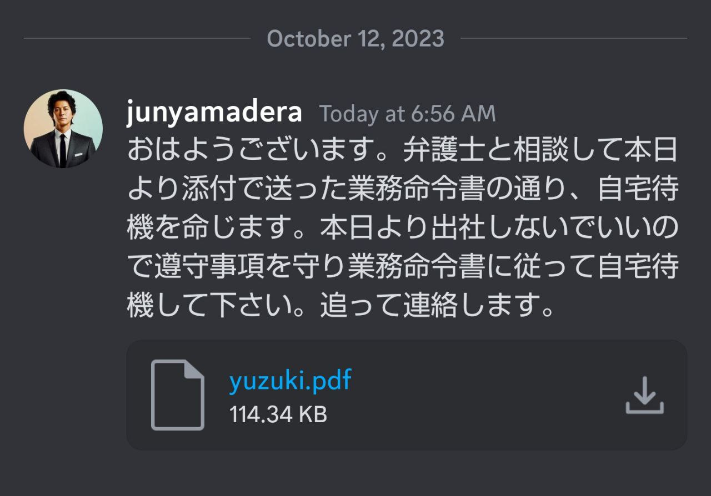
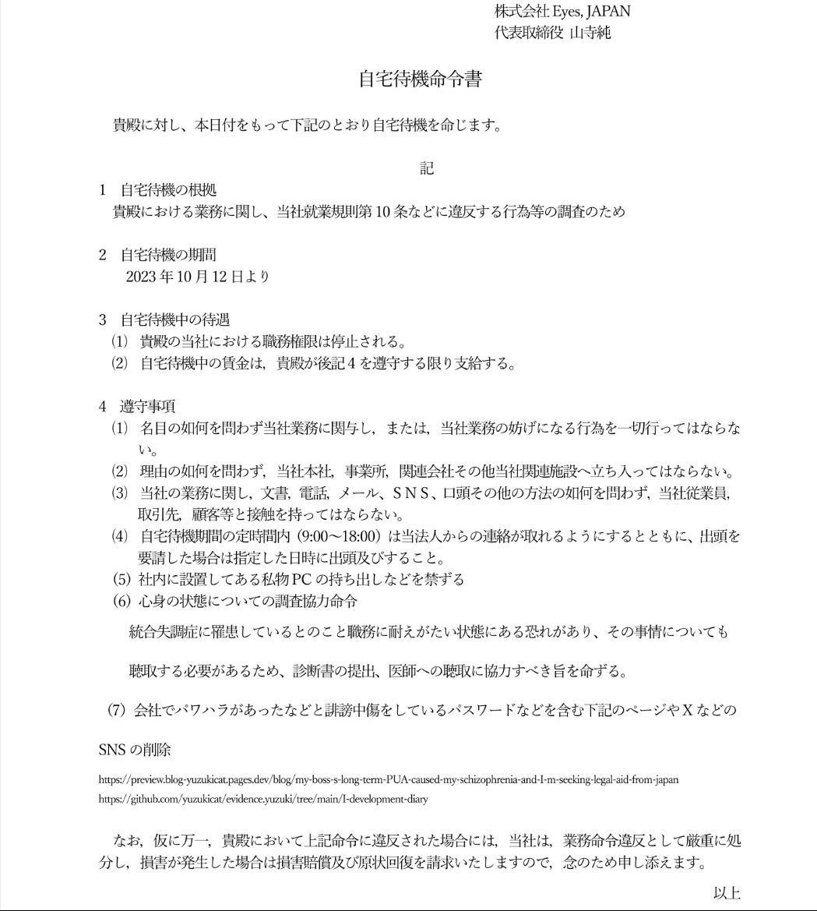
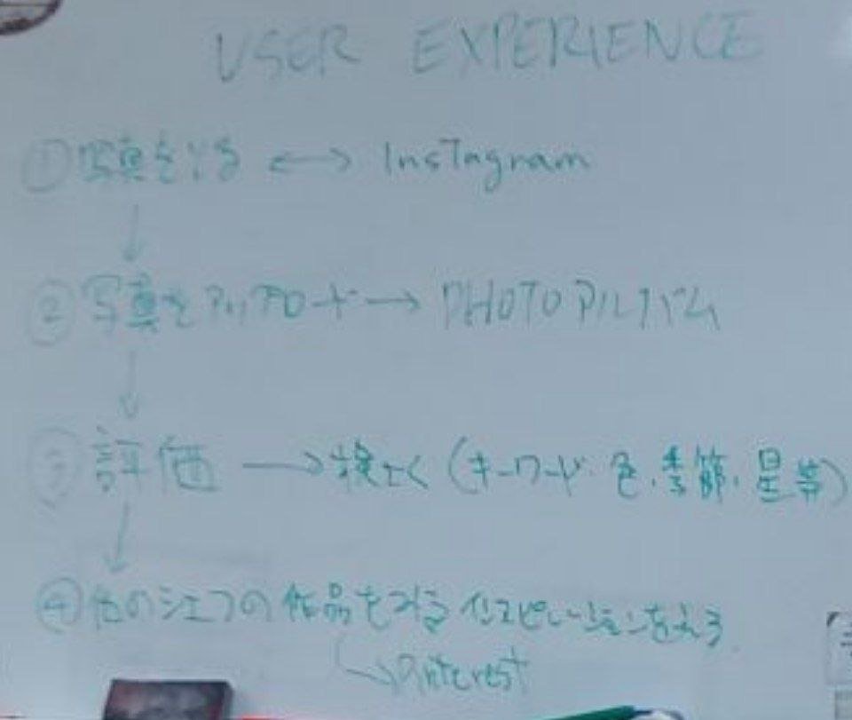
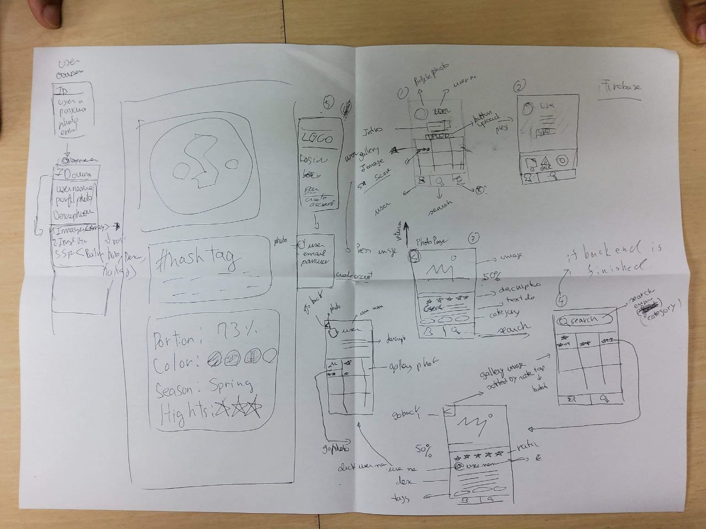

## 这篇文章有多语言版本，由Deep Learning Translate翻译

This article is available in multiple languages and was translated by Deep Learning Translate. For English:

この記事は多言語で掲載されており、ディープラーニング翻訳によって翻訳されました。日本語版:

## 查询猫猫的精神状态

这里的猫猫指我(笔者)，我的通称名是柚木(Yuzuki)，所以你可以叫我柚子、柚子猫或者猫猫。
通称是指在日本生活的外国人为了生活便利，使用的像日本人的名字一样的名字，在政府登记之后具备法律效力(例如签名)，未在政府登记也可以日常使用。
猫猫现在呆的公司在制度上由老板口头承认可以使用通称(不排除将来老板反悔了废除该制度的可能性)。

2023年9月27日，现在呆的公司的老板写了个清单列举对我不满的地方，然后让我写个检讨书。我认为与事实不符，因此我拒收。但是他硬塞给我，于是我当着他的面撕掉了。
这件PUA(パワハラ)事件发生在办公室隔壁的会议室，会议室内除了我和老板没有其他人在场，我是被一名实习生叫过去的，老板口头宣读了这个清单(都不敢正眼看我)，我对整个过程进行了录音，[**完整版的录音链接在One Drive上 - 230927_1714.wav**](https://kamisu66-my.sharepoint.com/:u:/p/yuzuki_cat/EeMGq3TcRGVKjO--3rvgyA8BrQjgZiBRkvMlYbTJe89Y7A?nav=eyJyZWZlcnJhbEluZm8iOnsicmVmZXJyYWxBcHAiOiJPbmVEcml2ZUZvckJ1c2luZXNzIiwicmVmZXJyYWxBcHBQbGF0Zm9ybSI6IldlYiIsInJlZmVycmFsTW9kZSI6InZpZXciLCJyZWZlcnJhbFZpZXciOiJNeUZpbGVzTGlua0RpcmVjdCJ9fQ&e=c9bHXA)。
因为精神经常处于紧张焦虑状态，声音也听起来很奇怪，请原谅。

后续是，2023年10月9日，我发现现老板给我家寄快递。目前我打算放置不管，我觉得他有病而且想把我踢了。

我求助获得日本劳动仲裁相关法律援助。现在呆的公司的老板长期对我 PUA(パワハラ)，让我背黑锅，造成我抑郁症状恶化，精神分裂症。同时故意使用过我dead name和错误的性别称呼来称呼我。我这边有我入职以来所有的邮件记录，Discord群聊和私聊记录。一部分会议和谈话记录。我公开了非涉密部分于这个 [Github仓库 - yuzukicat/evidence.yuzuki](https://github.com/yuzukicat/evidence.yuzuki) 和 One Drive。

我现在呆的公司老板给我家寄快递属于骚扰我。他对我进行了长期的 PUA(パワハラ)，向员工家里邮寄无证可依的清单让我写检讨书是骚扰行为。其次社会功能上，猫猫是 ADHDer，连 GAS 公司的催款单都会忘… 但我需要确认我“放置处理其快递”不是对方可预期的行为或者说是一种圈套。我觉得他可能有律师指点(也可能是我精神分裂症发作想多了)。

顺便我有个疑问就是，现在怎么不直接给我发 Discord 或者 E-Mail 呢? 他应该不知道我有备份 Discord 和邮件(即使他想事后删掉，那个时间点的备份还会存在)。

2023年10月12日，被现在呆的公司的老板Discord私聊告知不用去公司了，同时把我从Discord工作群移除了，把我从Github组织移除了，删除了我的工作邮箱，不过我认为我没有义务和老板通过Discord私聊聊天。他们更换了门禁密码并且禁止我去拿私人物品，我以之前工作的地方非法扣押我的私人物品报警，在三位警察的保护下拿回了我的私人物品。

因为现在呆的公司长期以来业务用PC和私用PC不分开，我的个人PC中存有本地Git仓库和客户资料。但第一我没有签署过保密协议(因为他们忘了入职的时候让我签)，第二即使签订了保密协议，公司规定也不可凌驾于法律之上 - 扣押我有所有权的私有物品。

## 猫猫声明

1. 证据的公开符合公司对我的保密约束。 我入职的时候没有被要求签订任何保密协议或者信息公开协议之类的文件，劳动合同中没有相关要求。公司的非正式规章制度叫做 RTFM 中，也没有相关规定。尽管在几次使用录音笔进行会议录音的时候，老板提出了反对，原话是“Fell Anonying”，但是我认为其反对并没有规章制度和法律上的效力。

2. 我的出勤没有任何问题。我的工资单记载了公司的纳税记录。这里的纳税是广义赋税，包括缴纳社保和年金的记录。这些记录本身证明了公司对我“出售劳动时间获取劳动报酬”的承认。其他辅助性证据包括，公司有日报制度，要求汇报每天的工作内容，有早会制度，由老板和同事共同确认当天的工作计划。这可以证明我的工作内容也是经过相应程序认可的。关于日报制度，我的部分日报在[**这个github文件夹** - I.开发者日志](https://github.com/yuzukicat/evidence.yuzuki/tree/main/I-development-diary) 和 [II.工作报告](https://github.com/yuzukicat/evidence.yuzuki/tree/main/II-work-report) 和 [III.周报](https://github.com/yuzukicat/evidence.yuzuki/tree/main/III-weekly-report)中可以找到。
对于工作记录的另一个证据是，对于我参与的项目，有 Github Commits，因为是公司的私有仓库，我无法公开，但它们应当可以被司法人员所调阅。我请假使用了年假或者病假并且事先提出了申请，按照程序发了邮件或在 Discord 频道中发送了消息，并且填写了 Google 日历。

3. 鉴于已经发生了“现在呆的公司的老板写了个清单列举对我不满的地方，然后让我写个检讨书”这样的事情，我在此声明: 因为与事实不符且涉嫌パワハラ，我拒绝承认并且签署任何后续由公司正式或者非正式提供的相关文件，包括如前文所述，我也不受“不可以使用录音笔对会议进行录音”、“不可以公开 Discord 或邮件记录”或类似规则的约束。任何由我现在呆的公司在2023年10月10日之后发布的关于此类规则或者约束的声明，声称我签署过并且应当遵守的说法，均与事实不符。如果公司可以提出相关证据，均非本人自愿签署，属于受到胁迫、伪造或其他类似的情况。
**我没有签署过信息保密协议(因为他们入职的时候忘了让我签署)，合同里也没有，就业规则里也没有(他们懒得修订加进去)。所以我并不怕被他们找麻烦。**

## パワハラ相关证据链

现在呆的公司的老板长期对我PUA(パワハラ)，让我背黑锅，造成我抑郁症状恶化，精神分裂症。同时故意使用过我 dead name 和错误的性别称呼来称呼我。对此证据链整理如下。

### FoodPlatingAI 项目中的パワハラ

这主要发生在2022年年末~2023年2月底。

我作为后端工程师按时完成了自己的工作。并且提供了简易的前端 Demo 便于前端接入。老板对我说，“你说你完成了并不能证明你完成了，我没有确认过”。当然，他只要确认下我的简易 Demo 就可以确认，如果他想要做更多的测试，也应该告诉我。但是公司没有任何 QA 方面的具体规定，因此我认为我可以汇报我完成了我的工作。

他对前端部分没有按时完成不满意，对前端设计也不满意。按照此项目会议时的录音(**参考One Drive上的录音证据**)，我并非此项目的 Leader ，项目的 Leader 是另一名同事。

但老板批评我缺乏责任心，作为全职员工和作为从最开始参与这个项目员工，应该对项目失败负有主要责任。

我在此说明: 我是后端工程师而不是项目经理(Project Manager)，因此我没有管理项目进度的义务，也没有督促前端同事尽快完成的义务。

作为**辅助性的证据**: 我对项目失败的客观原因进行说明如下: 前端没有任何设计文档。采用过于敏捷的开发。设计文档就是老板的口述。老板是一位选择性健忘人士，同时又经常提出一些不切实际的 ideas，例如“做一个 Instgram 风格的网站”。甚至连 Figma 之类的设计图也没有。只有一些不能称之为设计图的**手绘草稿**。如果不是参加过项目会议的与会者，根本不知道这些像古埃及壁画一般的草稿是什么意思。当然这是前端部分了。我并不会写前端。

> 做一个 Instgram 风格的网站

> 古埃及壁画一般的草稿

至于整个项目，因为营业的失败(老板大概自己兼任营业吧)，这个项目的开发方向变更过两次，目标客户变更过一次，从B2B摇摆到B2C。

但是老板对我进行了PUA(パワハラ)，导致我抑郁症的恶化并且伴随严重的自伤行为([TW WARNING 这是一张**我划手之后因为伤口处理不当导致感染的照片** - One Drive](https://kamisu66-my.sharepoint.com/:i:/p/yuzuki_cat/EYnDviyu1UxHrbVB3gQZEdIBpf9tUBRmpmr6Ltzv3K-muw?e=6gwCNw))、OD倾向和强烈的自杀意念，并在后续的诊断中被诊断为精神分裂症。**我的医生是这样对我说的:“你病情的恶化和精神分裂症与职场环境有直接关系”**。

作为一名跨性别，我在此期间同时被老板故意使用 dead name 和错误的性别称呼来称呼([**参考 DISCORD 聊天记录作为证据 - 参考此条 Github 链接**](https://github.com/yuzukicat/evidence.yuzuki/blob/main/IV-dis-pipeline/Direct%20Messages%20-%20Private%20-%20junyamadera%20%5B991178376134021140%5D.html))。

另外作为“精神分裂症患者”，同时恰好又是此期间被迫爆柜的，我对这件事的“精神分裂症式”看法如下: 因为年末纳税调整需要提交资料给公司，公司知道了我是“精神障碍者”，恰好此期间是一系列 PUA(パワハラ) 开始的时间点。很显然，如前文所述，项目的失败是不可避免的。我认为老板对“跨性别”对“精神障碍者”本身抱有歧视，只是借此把锅推给我，以让我自己离职。

不论此动机推测是否正确，PUA(パワハラ)的存在有**DISCORD聊天记录作为证据**，我摘录一些原文如下：

> フードプレーティングは一体全体どうなってますか？前回のmtgで厳しく言ったと思うのですが、全く進捗の報告もなく、一番最悪のデッドラインとして1月末と伝えてみんなで共有したと思いますが、いまだに何ももらっていなく大変不満です。前回のmtgですでに大幅に遅延しており、都度都度進捗を共有してくださいと強くお願いしてますが理解していますか？明日こちらで実際のお客様候補に話するのに、何も見せるものもないし、何のテストもしていません。本当に困っています。またこういう仕事の仕方は許容できないです。できてないのであれば事前にその旨をダイさんから報告すべきですし、もしできてたとしてもテストもしていないし使い方も何も聞いてません。もしダイさんが逆の立場、あるいはお客様の立場だったらどう思うでしょう？本当に真剣に考えてもらえますか？とにかく今の状況すぐにでも報告してください。もう限界です。
もし最低限のことができないならプロジェクトを任せることはできないので外れてもらうことも検討しなくてはならないです。これに限らず普段の仕事でも自分の仕事の共有や報告があまりにも無さすぎます。ちょっと本気で仕事の仕方考えてください。本当にまずいです。

> それはちょっとおかしくない？
デッドラインは1月末で最優先でやれと言ってたよね？
途中で報告無いのもおかしいと思わない？
アルバイト任せじゃ無くそこはフルタイムの人が責任持ってやるべきでは？
しかも現時点でいつできるのかも分からないって仕事として成り立ってないよ

> それがおかしいよ。玉橋くんこのプロジェクトのリーダでも無いしこの前ゆずきができてなかったからお手伝いしてるだけだし。
彼とは毎日目の前で仕事してるのに全然コミュニケーションとってないのかな？
あまりにも他人任せすぎじゃないかな？

> それは甘え過ぎだよ。
ゆずきさんができなかったからお手伝いしてもらってるだけだよ。彼も他のプロジェクトで精一杯だから無理ですよ。
毎週のweekly mtgや朝の朝礼でそれがわかるよね？
分からないならきちんと自分から期間と

> わざわざフランスに来たけどできてない事、何も見せるものが無いことは分かったので、しょうがないのでこちらでみんなに謝ってきます。正直本当にまずいけど、何よりもゆずきさんがこのプロジェクトに責任感をもっと持たないとダメです。アルバイトや他人任せでは無く自分の仕事に責任をもっと持ってもらいたいし、できてもできなくてももっと周りとコミュニケーション取っていれば防げたことと思います。きちんと理解してもらいたいです。

我想任何一个具有日语常识的人，都可以看出这些语句很糟糕。

### PD 项目中的パワハラ

正如Discord聊天记录所述的“プロジェクトを任せることはできないので外れてもらうことも検討しなくてはならない”，我后来就事实上被踢出了自己最开始就参与并担任架构和CI/CD的PD项目。

**事实上踢出就是指: 定期会议不再让我参加。不再维护CICD**。安排去做别的屎山项目/边缘项目或者“实现”老板那种“我们也做一个Chatgpt应用吧”的那种拍拍脑子提出来的ideas。

当然，这种破坏团队稳定性的做法在一般人看来很费解。你只能用我提到的“老板对“跨性别”对“精神障碍者”本身抱有**歧视**，只是借此把锅推给我，以让我自己离职”来解释不是吗。

你无法对无视提出指控，但无视也是一种欺凌。

### SupermarketAI 项目中的パワハラ

在经历了上述事件之后，猫猫觉得对 Discord 聊天记录、E-Mail 记录进行定期备份是有必要的，同时对会议进行录音和对会议中提的需求、达成的设计式样进行文档化并且进行多次邮件确认是有必要的。尽管我不是项目经理或者产品经理，但事实上也开始做这些事情。因此形成了非常完整的证据链条。

在**2023年8月29日**进行了一次原计划对产品本身的Review Meeting，参与者只有我和老板两个人并且发生在办公室隔壁的会议室。会议室没有其他人在场。我使用录音笔对本次会议进行了录音。

会议并没有按照“原计划”进行，而是变成了针对我本人的批评和人身攻击，并且也完全不符合事实。老板在我提出“会议已经偏离主题”时粗暴地声称“他有权力决定会议的主题”。[**完整版的录音链接在One Drive上** - 230829_1409.wav](https://kamisu66-my.sharepoint.com/:u:/p/yuzuki_cat/EQo6VNiIIxlOjKAsea1e7DgBAG7uNc7f_Kegj1mjFJWoNQ?nav=eyJyZWZlcnJhbEluZm8iOnsicmVmZXJyYWxBcHAiOiJPbmVEcml2ZUZvckJ1c2luZXNzIiwicmVmZXJyYWxBcHBQbGF0Zm9ybSI6IldlYiIsInJlZmVycmFsTW9kZSI6InZpZXciLCJyZWZlcnJhbFZpZXciOiJNeUZpbGVzTGlua0RpcmVjdCJ9fQ&e=H4Lygh)。

对于此录音证据，我将结合E-Mail通信的证据，指出其与事实不符和パワハラ的地方，[**关于E-Mail通信的证据，可以在这个Github仓库找到**](https://github.com/yuzukicat/evidence.yuzuki/tree/main/V-email-pipeline/2023)。

1. 老板说我应该对SupermarketAI项目的延期负有主要责任。我指出，首先，我按时完成了我的部分，而延期是由AI部分导致的，这部分工作是被分配给AI部门去做的。我作为同事，已经多次善意地提醒了AI部门负责此部分工作的人([**参考此邮件作为证据**](https://github.com/yuzukicat/evidence.yuzuki/blob/main/V-email-pipeline/2023/5/15/1881d57b7a421ea1.mht))。

> The AI prediction for overlaying daily sales at specific times (e.g.,12, 15, 17) will be handled **by Mark**, not me. I will be responsible for visualizing the data provided by Mark, which should be in CSV format.

并且我不是项目Leader(**参考邮件证据，同时后面的录音中老板也亲口承认了这一点**)，因此我并没有义务也没有职权去督促(or some kind you call it 'push')AI部门的同事。然而老板坚持认为我负有主要责任，存在沟通问题，没有把这个项目的优先度传达清楚(**参考录音证据**)。

2. 对我作为一名工程师的工作能力进行羞辱。老板的说法是，工作并非完全独立完成，全靠同事Edward的帮助，并且同事C的贡献最大，而我几乎没有贡献。抛开这种说法是为了故意羞辱我作为工程师的工作能力还是他选择性健忘又发作了。他的原话是:“I can not see your contribution”。总之这就是非常典的PUA(パワハラ)了。

我在本次会议中极力克制住自己紧张焦虑想哭的情绪，进行了相应的反驳。
首先，Edward的加入项目是老板本人的要求，我甚至在[**这封邮件**](https://github.com/yuzukicat/evidence.yuzuki/blob/main/V-email-pipeline/2023/5/15/1881d57b7a421ea1.mht)中提出过顾虑和反对。
> I think we should not rely too heavily on part-timers.
我想公司的同事或者Edward本人也可以作为**人证**来证明，老板在公司的周会上要求Edward加入。那么“全靠同事Edward的帮助”的这种说法就不成立。我只是服从工作安排。

然后，对于Cr的贡献度的问题，如果你读过**FoodPlatingAI 项目中的パワハラ**就会理解这只是一种管理上的混乱而已。因为Cr的工作成果完全偏离了最初的设计书，这个项目一直按照最初会议上决议并由邮件确认通过的设计式样进行开发，但是正如我说过的，这家公司过于敏捷，在某次Cr提出了一个Demo之后，原有的设计式样事实上被废弃了，尽管我们花费了大量的时间做了大量的前期工作。
设计式样的变更没有任何正式的书面文档，甚至我也不知道(因为Cr直接和老板进行了沟通)，最终产品采用了Cr的方案并且与设计式样不符，我感到莫名其妙。当然，从某种角度来说，这可能只是一种“项目成员贡献可见度”的问题，然而不管动机如何，PUA(パワハラ)的存在是事实。

最后，正如包括前文我所说的，这是我被事实上踢出PD项目之后丢过去的一个屎山项目。项目原本的负责人去年就已经离职，项目代码存在大量Bug(如果你阅读了**FoodPlatingAI 项目中的パワハラ**，你知道正如我提到过的公司没有明确的QA标准)。我和其他团队成员(包括Edward、Zhao、Yifan)为修复既存Bug投入了大量时间和精力，这些工作被Github Commits所记录。老板看不懂也不会去看Github Commits。这些都是“不可见”的工作。尽管我已经向老板报告了这一情况，但是他仍然“选择性遗忘”了这一事实。
AI部门的同事兼任该项目的Leader坚称“数据已经被清洗过了”([**参考这封邮件**](https://github.com/yuzukicat/evidence.yuzuki/blob/main/V-email-pipeline/2023/5/12/1880e245e303fea4.mht))。
> The data itself is already processed and cleaned.

事实上没有被清洗过因此我们必须写额外的代码做数据清洗工作。当然我不是数据工程师。我向老板多次邮件、口头报告了这一点，但被选择性遗忘。
在一次同AI部门的会议上，我问了“原始数据和已清洗的数据有什么区别”，AI部门做了回答。等于他们又承认了数据没有被清洗过。[**参考这份会议记录**](https://github.com/yuzukicat/evidence.yuzuki/tree/main/VII-record-of-proceedings)
> what is the difference between raw data and the cleaned up

这份会议记录是会议录音之后由OpenAI Whisper语音转文字模型转译而来。[**会议录音在One Drive上** - 230802_1255.wav](https://kamisu66-my.sharepoint.com/:u:/p/yuzuki_cat/EaVqCIW05ktNvsUE9CJ2WLABPlbrZF3LCVo57HDangS4PQ?nav=eyJyZWZlcnJhbEluZm8iOnsicmVmZXJyYWxBcHAiOiJPbmVEcml2ZUZvckJ1c2luZXNzIiwicmVmZXJyYWxBcHBQbGF0Zm9ybSI6IldlYiIsInJlZmVycmFsTW9kZSI6InZpZXciLCJyZWZlcnJhbFZpZXciOiJNeUZpbGVzTGlua0RpcmVjdCJ9fQ&e=5LBTZa)。
会议中，AI部门自己也承认了延期的存在并作出了相应的解释。
但是正如**猫猫声明**中那样，老板至今也在PUA(パワハラ)我、告诉我说延期是由我缺乏责任心造成的，应当由我承担主要责任(背锅)。

### 近期发生的パワハラ

以上种种，只是可以提出证据的PUA(パワハラ)事件。实际上，存在大量口头的，没有录音记录的，没有邮件记录的PUA(パワハラ)事件。我甚至推测其动机或许只是Gas Light精神障碍者以取乐。因为Edward同样遭受到过类似的骚扰。如果Edward愿意站出来发声的话，他可以作为**人证**。尽管Edward已经离职并且返回美国。

甚至这种恶意过于明晃晃: **比如参考这份邮件**。我只是使用自己的年假合理地请假去看医生并且提前一周申请。老板故意不批准并且PUA(パワハラ)我说:“公司有不批准的权力”、“RTFM里面有相关规定要提前两周请假才行”、“有任务分配给你了”要忙。事实上如果公司不批年假并且我因为个人原因无法出勤，公司应该从我的工资里扣除相应工时的报酬。并且你们RTFM里面找不到需要提前两周申请的规定(我很认真的我入职之前就把这玩意读过一遍了)。在这种无聊的地方恶心你大概属于一种岛国特色的欺凌，况且还信口开河地说RTFM里面有那你倒是找出来啊???
我只好低声下气地求他，于是他口头同意了(没有正式地邮件回复我)。[**参考这份录音** - 230904_1635.wav](https://kamisu66-my.sharepoint.com/:u:/p/yuzuki_cat/EZvhfgUz-MhGp9Pf2n1xXb0BUxQpwYf0GkWFvv3kJsY3vg?nav=eyJyZWZlcnJhbEluZm8iOnsicmVmZXJyYWxBcHAiOiJPbmVEcml2ZUZvckJ1c2luZXNzIiwicmVmZXJyYWxBcHBQbGF0Zm9ybSI6IldlYiIsInJlZmVycmFsTW9kZSI6InZpZXciLCJyZWZlcnJhbFZpZXciOiJNeUZpbGVzTGlua0RpcmVjdCJ9fQ&e=BKvXXp)，记录了整个对话的过程。当然作为精神分裂症确诊患者，我怀疑他故意口头批假但是不正式回邮件，我如果去看医生了我拿不出书面证据证明他批准过，事情就变成了我无断旷工。

经常性存在PUA(パワハラ)是以集体的名义对我进行人身攻击，这在**SupermarketAI 项目中的パワハラ**的录音中也有。其话术就是: “你..., 大家都是这么认为的”。现在想起来不得不说，这类言语对ASD猫猫有很大的伤害力。因为作为ASDer本来就会怀疑自己是不是社交做得不够好，现在老板站在一个权威者的位置说: “大家都觉得是因为你交流不够好才导致项目失败/延期的”，使得我非常的自我厌恶、讨厌自己，感到一种强烈的孤立感，觉得自己不配活着。
有一次我问他，你说大家都是这么认为的，那么你可以把大家都叫过来投票表决意见吗？他好像因为我这句顶嘴生气了一天。我精神状态稍好，或者理智在线的时候(ASDer很容易激惹或者被对方牵着鼻子走，承认一些自己没有犯过的错，大概和被诱供类似吧，在**SupermarketAI 项目中的パワハラ**的录音中，你可能会注意到这类欺凌和骚扰的隐蔽性)，会反驳两句。不过我现在也觉得，大概无论我怎么做都没有什么用，被 GAS Light 了就会一直遭到 GAS Light吧，我可能就是背锅体质。

在我求助之后，一位群友告诉我，首先，公司应该给你分配适合你能力的工作，或者进行相应的培训。公司可以以能力不足辞退你，但是没有批评你的权力。
一直以来我都没有意识到这一点。

其实还有一件事没有物证，除非有兼职员工肯出来作证。我被长时间(某些时候一天大于两小时)安排去做拿快递，倒垃圾，整理快递纸箱之类的工作，不仅民法上是权力骚扰，也违反了入管法关于不得从事签证类型规定之外的工作的要求。我可以去举报，如果核实，现在呆的公司会被罚款。我在想我要不要报复。

我于2023年4月6日由慶應義塾大学病院的医生诊断为精神分裂症并于于2023年6月1日被开出舒必利的处方，开始服用抗精神病药。正如我的医生所说的:**“你病情的恶化和精神分裂症与职场环境有直接关系”**。老板的PUA(パワハラ)导致了我抑郁症状的加重，包括自尊心的底下，全天的情绪低落、忍不住想哭、自伤行为(**这张图片**是2023年月日的一次划手，从背景你可以看出来，发生在公司的工位上)，强烈的自杀意念，解离(严重地影响我的日常生活)。

## 尝试寻求法律援助

我对日本的法律不熟悉，因此寻求帮助。

其实我从来不抱什么希望，我觉得我挣扎之后还是会被撕碎，就像以前发生过很多次的那样。

但是还是想尝试一下，因为知道有你们在。

我目前还没有从现在呆的公司离职，处于在职状态。因为自己离职在雇佣保险上会被认定为个人原因离职，而显然公司和公司老板存在过错。

关于我的日语水平，日本人说话我基本都能听懂 但是可能会因为as特征看起来不像听懂了的样子，口语可以表达清楚，N1随便考接近满分。

我想知道这些事情:

1. 我对老板给我家邮寄的快递放置不管是否是最好的做法，或者说我应该签收 - 这份列举对我不满的地方的清单本身可以构成PUA(パワハラ)的证据。

2. 就目前掌握的证据而言，起诉或者劳动仲裁成功的机率，如果成功率低，是否可以采取其他斗争手段(以爆他金币或者让事件曝光为目的)。

## 法律诉求

### 起诉或劳动仲裁

起诉株式会社Eyes, Japan的老板山寺 纯对其员工 Yuzuki(存在长期的PUA(パワハラ))事实。要求出于保护原则，尽快以公司过错为理由解除劳动合同，赔偿精神损失费10*月工资*0.7，支付离职补偿(1+1)*月工资

### 起诉或劳动仲裁达成和解

道歉信。

保留原职，并批准为期6个月的休职。期间公司继续按照最低一档缴纳保险和年金。社会保险支付相应的伤病保险金。6个月后视恢复情况恢复原职或个人原因离职。

## 联系方式

电报: https://t.me/SakuradaYuzu

邮箱: sara.yuzuki@proton.me